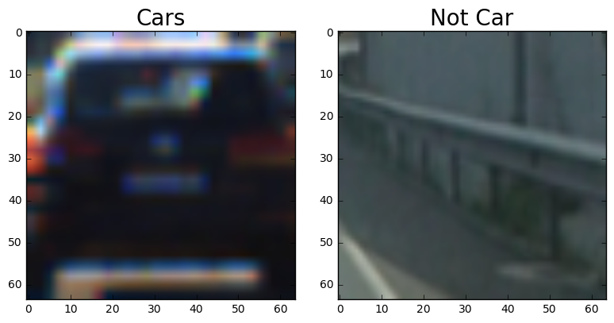
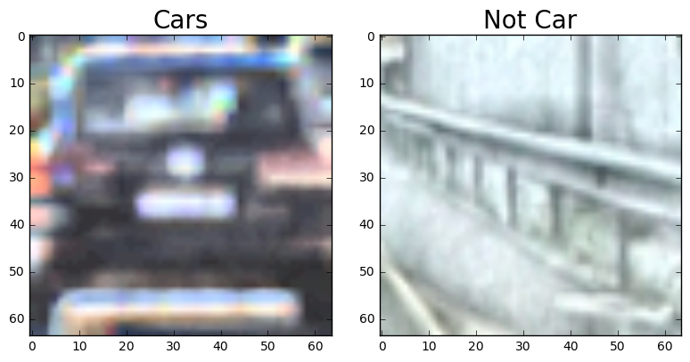
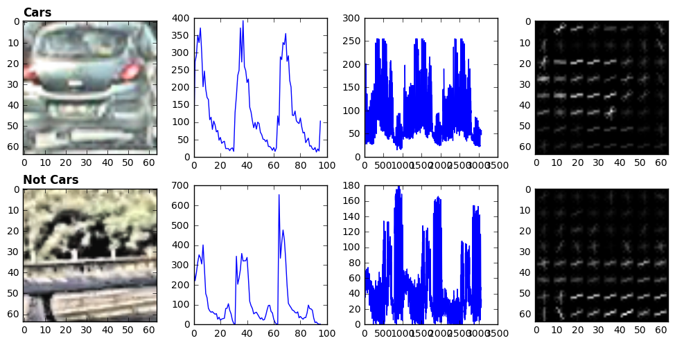
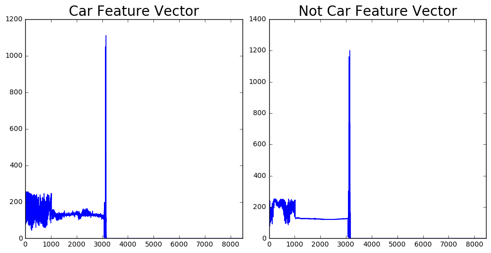
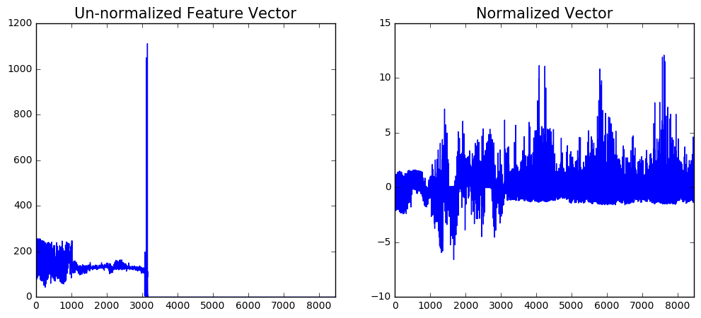
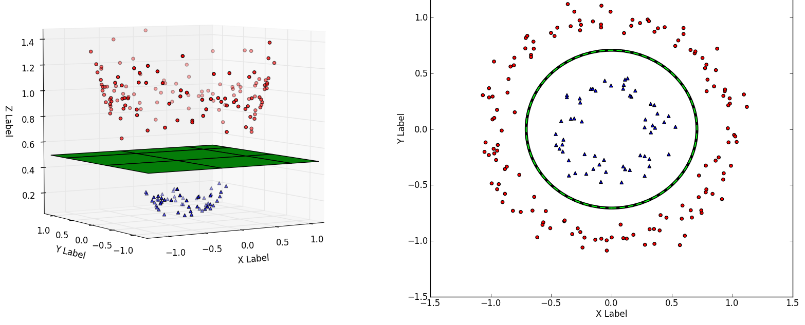

# Vehicle Detection and Tracking
--------------------------------

This repo is the Project 5 of Udacity Self-Driving Car Nanodegree. 

In the next following sections, we would walk through the pipeline how to detect and track cars from a video stream using Support Vector Machine (SVM) Classifier. This process involves few intersting Computer Vision topics such as Histogram of Gradients (HOG), Spatial binary and Color Histogram.

We divided this tutorial the into several sections : 
1. [Extract Image Feature Vector](#1-extract-image-feature-vector)
2. [Train SVM Classifier](#2-train-svm-classifier) 
3. [Vehicle Detection](#3-vehicle-detection) 
4. [Vehicle Tracking](#4-vehicle-tracking)
5. [Video Pipeline](#5-video-pipeline)

## 1. Extract Image Feature Vector
The goal is to extract useful information from image so that the computer can quickly detect where is the car and where is not the car. One powerful way is to extract the Histogram of Gradients (Shape of the object), Color histogram (color of the object) and Spatial binary (overal feature of the object). Here is the example of a car and not-a-car image:


#### Trick 1: Adaptive Histogram Equalization before extracting feature.
We discovered that the training data is somewhat blurry and noisy. In this project, we combine the Feature vector of each image so it is important to have a clear image for training. In Deep Learning approach, however, it might help the model generalize better.

By applying `Adaptive Histogram Equalization` (AHE), we could achieve better image quality. **The trade-off is speed**. Thus, we only apply AHE during training.**
```
def adaptive_equalize_image(img, level):
    """
    Adaptive Histogram Equalization : http://docs.opencv.org/3.1.0/d5/daf/tutorial_py_histogram_equalization.html
    """
    clahe = cv2.createCLAHE(clipLimit=level, tileGridSize=(8, 8))
    if img.shape[2] == 3:
        lab = cv2.cvtColor(img, cv2.COLOR_RGB2LAB)
        l, a, b = cv2.split(lab)
        cl = clahe.apply(l)
        result = cv2.merge((cl, a, b))
        result = cv2.cvtColor(result, cv2.COLOR_LAB2RGB) 
    else:
        result = clahe.apply(img)
    return result
```


#### Pre-processing:
`adaptive_histogram_equalization`: **True**

#### HOG Parameters


| Parameters      | Value |
|---------------- |-------| 
| `orientation`   | 9     |
| `pix_per_cell`  | 8     | 
| `cell_per_block`| 2     | 
| `hog_channel`   | `'ALL`'|
| `transform_srt` | False |
| `feature_vector`| True  |


#### Color Histogram Parameters:

| Parameters   | Value     |
|------------- |-----------| 
| `nbins`      | 32        |
| `bin_range`  | (0.0, 1.0)| 


#### Spatial Bin Parameters:
| Parameters   | Value   |
|------------- |---------| 
| `color_space`| `YCrCb` |
| `spatial_bin`| (32, 32)| 

In following graph, we extract features from two images and display in order of : Spatial Bin, Color Histogram, Histogram of Gradient


#### Normalize Feature Vector
To avoid bias over one feature, we need to normalize the data using `StandardScaler()`
```
from sklearn.preprocessing import StandardScaler
```
**Before normalization**


**After normalization**


## 2. Train SVM Classifier
Next is to build a Support Vector Machine Classisifer to classify the image whether it is a car or not. Basically, SVM will convert the current dataset into higher dimentional space in order to make the classification process easier.


```
# svc = Pipeline([('scaling', StandardScaler()), ('classification', LinearSVC(loss='hinge')),])
svc = SupportVectorMachineClassifier()
# Apply Standard Scalars to normalize vector
svc.train(x_train, y_train)
# Test on testing set
score = svc.score(x_test, y_test)

OUTPUT:
Starting to train vehicle detection classifier.
Completed training in 4.649303 seconds.

Testing accuracy:
Accuracy 0.992399%
```

## 3. Vehicle Detection
There will be two parts:

* Using sliding technique: slow and provide a lot of False Positives
* Using subsampling HOG and adding heatmap threshold: faster and eliminate a lot of False Positives

1. Describe how (and identify where in your code) you implemented a sliding window search. How did you decide what scales to search and how much to overlap windows?
I decided to search random window positions at random scales all over the image and came up with this (ok just kidding I didn't actually ;)

2. Show some examples of test images to demonstrate how your pipeline is working. What did you do to optimize the performance of your classifier?

## 4. Vehicle Tracking

We created two object in order to make the tracking task easier: `Vehicle` and `VehicleTracker`. Both are available under `utils/VehicleTracker.py`

* `Vehicle` object holds information about the bounding box, pixels belong to an vehicle and old bounding boxes.
* `VehicleTracker` object keeps track a list of current tracked vehicles and making new adjustments based on new heatmaps from video stream


## 5. Video Implementation

1. Provide a link to your final video output. Your pipeline should perform reasonably well on the entire project video (somewhat wobbly or unstable bounding boxes are ok as long as you are identifying the vehicles most of the time with minimal false positives.) 

Here's a link to my video result: 

2. Describe how (and identify where in your code) you implemented some kind of filter for false positives and some method for combining overlapping bounding boxes.

I recorded the positions of positive detections in each frame of the video. From the positive detections I created a heatmap and then thresholded that map to identify vehicle positions. I then used scipy.ndimage.measurements.label() to identify individual blobs in the heatmap. I then assumed each blob corresponded to a vehicle. I constructed bounding boxes to cover the area of each blob detected.

Here's an example result showing the heatmap from a series of frames of video, the result of scipy.ndimage.measurements.label() and the bounding boxes then overlaid on the last frame of video:

Here are six frames and their corresponding heatmaps:


```
# Parameter
xstart = [500, 0]
xstop =  [1280, 1280]
ystart = [400, 400]
ystop =  [506,  656]
scales = [0.75,1.35]
# Vehicle Tracker
car_tracker = VehicleTracker(looking_back_frames=15)

def process_image(frame):
    global svc
    global car_tracker
    global ystar, ystop, scale
    svc_img = np.copy(frame)
    
    heatmaps = []
    # Multi-scale window
    for i, scale in enumerate(scales):
        heatmap, windows = find_cars(frame,xstart[i], xstop[i], ystart[i], ystop[i], scale, svc, dec_thresh=0.99)
        heatmaps.append(heatmap)
        
    # Combine heat map
    heatmap = np.sum(heatmaps, axis=0)
    heatmap[heatmap <= 5.] = 0
    cars, heatmap = car_tracker.update(heatmap, heat_threshold=30)
    
    # Draw car boxes
    for p1, p2 in itertools.chain(cars):
        cv2.rectangle(svc_img, p1, p2, (255, 255, 255), 4)
    # Create an heat image
    img = 255*heatmap/np.max(heatmap)
    img = np.dstack((img, heatmap, heatmap)).astype(np.uint8)
    svc_img = cv2.addWeighted(svc_img, 0.8, img, 1.0, 0.0)
    return svc_img
```

## Discussion
1. Briefly discuss any problems / issues you faced in your implementation of this project. Where will your pipeline likely fail? What could you do to make it more robust?

Here I'll talk about the approach I took, what techniques I used, what worked and why, where the pipeline might fail and how I might improve it if I were going to pursue this project further.

The pipeline still detects a few false positives. One thing that can help make this more reliable would be a way to detect the horizon and automatically mask out only those places where a vehicle can show up.

The current pipeline runs at a speed of ~3-6 frames per second on a 2011 Macbook Pro. Using convolutional neural networks for the initial segmentation of the image might be much faster than a Support Vector Machine classifier such as the one used here. This might enable real-time vehicle detection and tracking.
